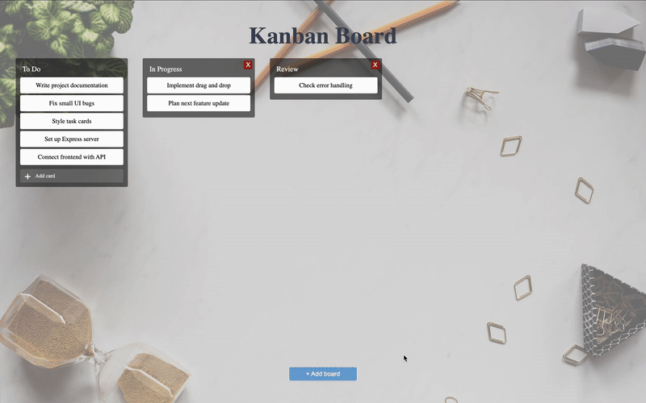

# 🗂️ Kanban Board – Full-Stack JavaScript (Express + Vanilla JS)

CRUD boards and tasks with drag-and-drop support, JSON persistence, and dynamic UI updates.

---

## 🚀 Overview

Built a **full-stack Kanban board** using **Express**, **modular Vanilla JS**, and **REST APIs**.  
Implements full **CRUD functionality** for boards and tasks, inline editing, and **drag-and-drop** movement between columns.  
Data is persisted to a local JSON file to simulate basic database behavior.

This project demonstrates a complete end-to-end workflow — from backend API design to dynamic frontend rendering.

---

## 📽️ Demo



--

## 🧠 Features

- 🪄 Create, update, and delete **boards**
- 📝 Add, edit, and delete **tasks**
- 🔀 **Drag and drop** tasks between boards
- 💾 **JSON-based persistence** (no external DB required)
- ✨ Inline title editing with auto-save
- 🔁 Modular structure (`api.js`, `ui.js`, `main.js`)
- ⚙️ RESTful API built with **Express**
- 🧱 Follows **MVC architecture** for backend organization

---

## 🧩 Tech Stack

**Frontend**
- HTML5 / CSS3 / SCSS  
- Vanilla JavaScript (ES Modules)

**Backend**
- Node.js  
- Express.js

**Data Storage**
- JSON file (read/write via helper functions)

---

## ⚙️ Setup & Run Locally

```bash
# Clone repository
git clone https://github.com/yourusername/kanban-board.git
cd kanban-board

# Install dependencies
npm install

# Start backend server
node backend/server.js

